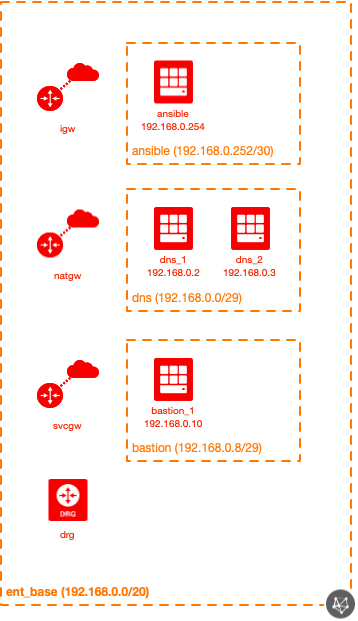
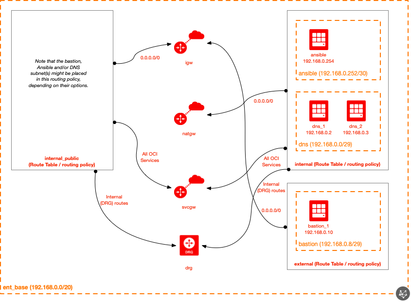
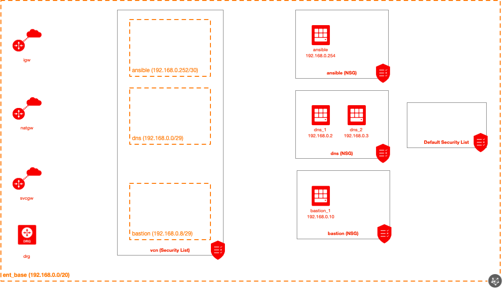
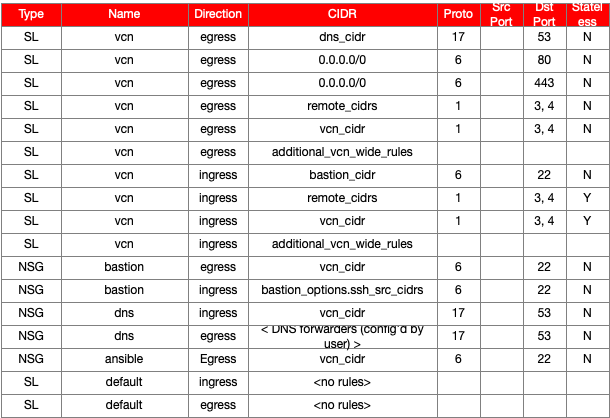

# Oracle Cloud Infrastructure Enterprise Base Module for Terraform

## Introduction

This module shows how to deploy a basic starting architecture that is suitable for many OCI environments, providing the foundational components needed to run 3-tier Enterprise Applications  


## Solution

The enterprise base module provides the ability to create the following resources:

| Resource | Created by Default? |
|---|---|
| Core Network module | Yes |
| Bastion module | Yes |
| Hybrid DNS module | Yes |
| Ansible module | Yes |

The following features have been added to the above modules:

* Ability to clear (empty) the default Security List
  * This allows for the ability to create a "blackhole" subnet type of functionality (similar in behavior to a "blackhole" VLAN).
* VCN-wide Security List
  * Allows for consistent security policy application across the environment as a whole (with minimal user effort).
  * Attributes to permit (or disable the creation of rules permitting) outbound HTTP and/or HTTPS access.
* Adds routes for internal (on-prem) CIDRs, pointing to the DRG as a next-hop
* Automatically allows Path MTU Discovery to/from internal (on-prem) CIDRs)

## Diagrams

### Topology
Here's a quick snapshot into the default topology created by this module:



### Logical
Here's a diagram of the logical topology:



### Security Policy
Here are the NSG(s) created by this module (by default):



Here's the default security policy that is created by this module:




## Getting Started

Several fully-functional examples have been provided in the `examples` directory.  Please reference the `README.md` in each example directory for any directions specific to the example.

For getting going quickly, at minimum, you need the following (for the most basic deployment):

```
module "entbase" {
  source           = "../../"
  
  default_compartment_id = "${var.compartment_id}"
  default_ssh_auth_keys = [ "<path to your SSH public key>" ]
  # only one of the following two attributes are required
  default_img_id = "ocid1.image.xxxxxxx"
  default_img_name = "Oracle-Linux-xxxxxxxx"
}
```

An example shows how to deploy the enterprise base topology using the module defaults (review this document for a detailed description of these).

## Accessing the Solution

This is an architectural module.  Depending on the settings, there could be a bastion, DNS forwarders and an Ansible control machine to access.

You may continue to manage the environment using Terraform (ideal), OCI CLI, OCI console (UI), directly via the API, etc.


### Route Tables

There are three Route Tables created by this module.  Refer to the Logical diagram (above) to get a visual of the routing policies of each of the following:

* internal
  * Does not allow for exposing public IP addresses to the Internet (does not use the IGW).
* internal_public
  * Uses the IGW as a default route (0.0.0.0/0), permitting the use of public IP addresses (while still having access to internal/DRG resources).
* external
  * Does not have any routes to DRG resources.  Only has routes to the IGW and SVCGW.

### Security Lists

**`Default Security List`**

The default behavior is to clear (empty) the default Security List, effectively creating a "blackhole" subnet behavior.  This provides that if a user creates a subnet that uses the default Security List (the default behavior if another security list isn't specified), that no traffic will be permitted.  This is similar behavior to configuring a "blackhole VLAN" in traditional LANs/DCs.

**`VCN-Wide Security List`**

A VCN-wide Security List is used.  So long as each subnet created is configured to use the VCN-wide Security List, this provides for a very easy, low-maintenance and scalable solution to having a single security policy across all subnets in a VCN.  NSGs are used to provide more specific security rules which impact only a single subnet (or group of resources).

**`DHCP Options`**
There are two DHCP Options created:

* internal
  * This is expected to be used by as many internal systems as possible (with the exception of systems that require the use of `VCN/Internet Resolver` such as databases, DNS forwarders, etc.).  The vast majority of internal systems should use this DHCP Option.  If custom DNS forwarders (hybrid DNS) is used, the DNS forwarder IP addresses will be configured in this DHCP Option (otherwise the `VCN/Internet Resolver` will be used).
* dns_forwarders
  * This is to be used on the subnet(s) used by DNS forwarders.  DB systems (DBsys, ExaCS, etc) or other services that require using the native `VCN/Internet Resolver` should use this DHCP Option.

It might seem unnecessary to create two DHCP Options in situations where hybrid DNS is not used, however by creating and using this structure, it saves some steps when hybrid DNS might be needed in the future (alleviates some of the work that needs to be done).

## Module Inputs

| Attribute | Data Type | Required | Default Value | Valid Values | Description |
|---|---|---|---|---|---|
| default\_compartment\_id | string | yes | none | string of the compartment OCID | This is the default OCID that will be used when creating objects (unless overridden for any specific object).  This needs to be the OCID of a pre-existing compartment (it will not create the compartment. |
| vcn\_id | string | yes | none | string of the VCN OCID | The OCID of the VCN that is to be used must be provided here. |
| vcn\_cidr | string | yes | none | string of the VCN CIDR | The CIDR of the VCN that is to be used must be provided here. |
| default\_defined\_tags | map(string) | no | {} | Any map of tag names and values that is acceptable to the OCI API. | If any Defined Tags are set here, unless overwritten at the resource level, will be applied to all resources created by this module. |
| default\_freeform\_tags | map(string) | no | {} | Any map of tag names and values that is acceptable to the OCI API. | If any Freeform Tags are set here, unless overwritten at the resource level, will be applied to all resources created by this module. |
| default\_ssh\_auth\_keys | list(string) | no | [] | Any list of public (authorized) SSH keys. | The different authorized keys that are used (unless otherwise indicated on compute instances). |
| default\_img\_id | string | no | null | OCID of compute instance image. | If this is provided, it can be used as the default image OCID for resources created (unless otherwise specified at the resource level). |
| default\_img\_name | string | no | null | Name of compute instance image. | If this is provided, it can be used as the default image to be used for resources created (unless otherwise specified at the resource level).  The name can be obtained from https://docs.cloud.oracle.com/iaas/images/.  By providing a name (rather than an OCID), the module looks up the OCID (by the name) automatically. |
| internal\_drg\_routes | list(string) | no | [] | List of CIDR strings. | If there are CIDRs that should be routed towards the DRG to connect to other networks (on-prem, etc) via FastConnect and/or VPN, provide the CIDRs here.  This paramter not only controls route rules (pointing these CIDRs towards the DRG), but also permits Path MTU Discovery (ICMP Type 3, Code 4) to/from these CIDRs (using the VCN-wide Security List). |
| internal\_rt\_rule\_overrides | any | no | See the structure of route rules (network core module) for the data structure to use here (should be the same - the value here is passed through to it). | If the default `internal` Route Table rules are not desired, you may provide your own here. |
| internal\_public\_rt\_rule\_overrides | any | no | See the structure of route rules (network core module) for the data structure to use here (should be the same - the value here is passed through to it). | If the default `internal_public` Route Table rules are not desired, you may provide your own here. |
| external\_rt\_rule\_overrides | any | no | See the structure of route rules (network core module) for the data structure to use here (should be the same - the value here is passed through to it). | If the default `external` Route Table rules are not desired, you may provide your own here. |
| create\_vcn\_wide\_sl | bool | no | true | true or false | Whether or not to create a VCN-wide Security List. |
| use\_default\_vcn\_wide\_rules | bool | no | true | true or false | Whether or not to use the default rules for the VCN-wide Security List. |
| vcn\_wide\_sl\_options | see below | no | see below | see below | These are parameters which can modify the default behavior of the module in regards to what rules are configured by default in the VCN-wide Security List. |
| additional\_vcn\_wide\_rules | defined in network-security core module | no | null | This field allows you to add rules (if use_default_vcn_wide_rules is true) or use only your own rules (if use_default_vcn_wide_rules is false).  See the structure of Security List rules (network-security core module) for the data structure to use here (should be the same - the value here is passed through to it). |
| empty\_default_security\_list | bool | no | true | true or false | Whether or not the default Security List in the VCN should be emptied (effectively creating a "blackhole" type of effect for any subnets associated with the default Security List). |
| vcn\_cidr | string | no | "192.168.0.0/20" | Any valid CIDR in a string. | The CIDR that should be used for the VCN. |
| vcn\_dns\_label | string | no | "entbase" | Any valid DNS label. | This is the DNS label assigned to the VCN. |
| vcn\_name | string | no | "ent_base" | Any valid VCN name. | The name that should be used for the VCN. |
| vcn\_options | see below | no | see below | see below | The different optional parameters for customizing the VCN. |
| create\_igw | bool | no | true | true/false | Whether or not a IGW should be created in the VCN. |
| create\_natgw | bool | no | true | true/false | Whether or not a NATGW should be created in the VCN. |
| create\_svcgw | bool | no | true | true/false | Whether or not a SVCGW should be created in the VCN. |
| create\_drg | bool | no | true | true/false | Whether or not a DRG should be created in the VCN. |
| drg\_options | defined in network core module | no | null | See the structure of drg\_options in the network core module for the data structure to use here (should be the same - the value here is passed through to it). |
| create\_bastion | bool | no | true | true/false | Whether or not a bastion should be created. |
| bastion\_subnet\_cidr | string | no | "192.168.0.8/29" | String of a valid CIDR. | You may specify the CIDR to use for the bastion subnet. |
| bastion\_options | see below | no | see below | see below | The optional parameters for customizing the bastion components. |
| create\_ansible | bool | no | true | true/false | Whether or not a Ansible control machine should be created. |
| ansible\_subnet\_cidr | string | no | "192.168.0.8/29" | String of a valid CIDR. | You may specify the CIDR to use for the Ansible subnet. |
| ansible\_options | see below | no | see below | see below | The optional parameters for customizing the Ansible components. |
| create\_dns | bool | no | true | true/false | Whether or not hybrid DNS forwarders should be created. |
| existing\_dns\_forwarder\_ips | list(string) | no | null | List of DNS forward IP addresses (as strings). | If DNS forwarders should not be created, but rather existing DNS forwarders be used, these can be specified.  This will result in the `internal` DHCP Options to be configured to use these forwarders.  These are used when `create_dns` is false (and this attribute is set to a valid value). |
| allow\_vcn\_cidr\_ingress\_dns\_forwarders | bool | no | true | true or false | Whether or not the DNS forwarders NSG should have the VCN CIDR permitted ingress on udp/53. |
| dns\_namespace\_mappings | see below | no | see below | see below | Setting the mapping between DNS namespaces and the DNS forwarders that should be queried for each namespace. |
| reverse\_dns\_mappings | see below | no | see below | see below | Reverse DNS mapping entries. |
| dns\_options | see below | no | see below | see below | Optional attributes to customize the hybrid DNS resources. |
| dns\_forwarder\_1 | see below | no | see below | see below | Parameters for customizing DNS forwarder #1 that is created (if create\_compute is true). |
| dns\_forwarder\_2 | see below | no | see below | see below | Parameters for customizing DNS forwarder #2 that is created (if create\_compute is true). |
| dns\_forwarder\_3 | see below | no | see below | see below | Parameters for customizing DNS forwarder #3 that is created (if create\_compute is true). |

### vcn_options

The `vcn_options` attribute is an optional map attribute.  Note that if this attribute is used, all keys/values must be specified (Terraform does not allow for default or optional map keys/values).  It has the following defined keys (and default values):

| Key | Data Type | Default Value | Valid Values | Description |
|---|---|---|---|---|
| compartment\_id | string | null | Compartment OCID | Pre-existing compartment OCID (if default compartment is not to be used).  If this value is null, the default compartment OCID will be used. |
| defined\_tags | map(string) | {} | Any map of tag names and values that is acceptable to the OCI API. | If any Defined Tags should be set on this resource, do so with this attribute.  If not specified, the default\_defined\_tags value will be used. |
| freeform\_tags | map(string) | {} | Any map of tag names and values that is acceptable to the OCI API. | If any Freeform Tags should be set on this resource, do so with this attribute.  If not specified, the default\_freeform\_tags value will be used. |
| enable\_dns | bool | true | Whether or not DNS should be enabled for the subnet. |

These options are largely a pass-through for the network core module.

***Example***

```
module "entbase" {
  ... /snip - shortened for brevity...

  default_compartment_id  = var.default_compartment_id
  
  vcn_options      = {
    compartment_id    = null
    defined_tags      = null
    freeform_tags     = null
    enable_dns        = false
  }
}
```

The above example will configure the VCN to use the default compartment OCID and disable the use of a private DNS namespace in the VCN.

### vcn_wide_sl_options

The `vcn_wide_sl_options` attribute is an optional map attribute which is used to configure the presence (or absence) of specific rules in the VCN-wide Security List.  Note that if this attribute is used, all keys/values must be specified (Terraform does not allow for default or optional map keys/values).  It has the following defined keys (and default values):

| Key | Data Type | Default Value | Valid Values | Description |
|---|---|---|---|---|
| allow\_http\_egress | bool | true | true or false | Whether or not HTTP (tcp/80) should be permitted egress to 0.0.0.0/0 in the VCN-wide Security List. |
| allow\_https\_egress | bool | true | true or false | Whether or not HTTPS (tcp/443) should be permitted egress to 0.0.0.0/0 in the VCN-wide Security List. |

These are useful for controlling the egress rules configured in the VCN-wide Security List.

***Example***

```
module "entbase" {
  ... /snip - shortened for brevity...

  default_compartment_id  = var.default_compartment_id
  
  vcn_wide_sl_options      = {
    allow_http_egress      = false
    allow_https_egress     = false
  }
}
```

The above example will have the VCN-wide Security List not permit HTTP (tcp/80) or HTTPS (tcp/443) from being permitted egress to the any IP address (0.0.0.0/0).

### bastion_options

The `bastion_options` attribute is an optional map attribute.  Note that if this attribute is used, all keys/values must be specified (Terraform does not allow for default or optional map keys/values).  It has the following defined keys (and default values):

| Key | Data Type | Default Value | Valid Values | Description |
|---|---|---|---|---|
| subnet\_compartment\_id | string | null | Compartment OCID | Pre-existing compartment OCID (if default compartment is not to be used).  If this value is null, the default compartment OCID will be used. |
| subnet\_name | string | "bastion" | Any name acceptable to the OCI API. | Used to define a specific name for the subnet. |
| subnet_cidr | string | "192.168.0.8/29" | IPv4 CIDR | Specify the IPv4 CIDR to be used for the Subnet. |
| subnet\_dns\_label | string | "bastion" | Valid DNS name. | Specify the DNS label to be used for the subnet.  If this value is null, a dynamically generated value of *subnet<index_num>* will be used.  For example, the third subnet definition, if DNS is enabled, but no dns_label is provided (a null value is given), a value of *subnet2* will be generated (remembering that index numbers are zero-indexed). |
| instance\_compartment\_id | string | null | Compartment OCID | Pre-existing compartment OCID (if default compartment is not to be used).  If this value is null, the default compartment OCID will be used. |
| instance\_ad | number | 0 | The zero-indexed number of the desired AD. | Provide a number to indicate the AD you'd like the compute instance deployed to.  The number should be zero-indexed, meaning AD1 = 0, AD2 = 1, AD3 = 2, etc. |
| instance\_name | string | "bastion" | Any valid name string. | The name of the compute instance to create. |
| instance\_dns\_label | string | "bastion" | Any valid hostname string. | The DNS name (label) to use for the compute instance. |
| instance\_shape | string | "VM.Standard2.1" | String of valid OCI shape. | Provide the desired shape to be used for the new compute instance. |
| ssh\_auth\_keys | list(string) | default\_ssh\_auth\_keys | A list of strings of public (authorized) SSH keys. | If you've provided a value for default\_ssh\_auth\_keys and do not wish to override this, there's no need to set this to anything besides null.  If you do want to specify different/unique SSH authorized keys, specify them here. |
| ssh\_src\_cidrs | list(string) | [] | The different CIDRs that are permitted to access the bastion via SSH. |
| image\_name | string | null | Any valid OCI image name. | You may provide a name of a specific compute image you'd like to use here.  If not set, it'll default to using whatever default\_img\_name is set to. |
| image\_id | string | null | Valid OCID of a compute image. | You can specify the OCID of a compute image by setting this value.  If an OCID is provided, the image name will not be used (OCID has a higher precedence than the image name). |
| private\_ip | string | null | null or any valid IP address string. | If you desire to specify a specific static private IP address, provide the value here.  If you do not provide a value, the next available private IP address will be used. |
| allow\_int\_routes | bool | true | true or false | Whether or not the bastion should be given access to internal routes (versus only being exposed to public-facing resources).  This effectively sets the route table (if public_ip == false and allow_int_routes == true, it'll use the `internal` Route Table, if public_ip == true and allow_int_routes == true, it'll use the `internal_public` Route Table and finally if both values are false, it'll use the `external` Route Table). |
| public\_ip | bool | false | true or false | Whether or not a public IP address should be allocated to the compute instance. |
| use\_default\_nsg\_rules | bool | true | true or false | Whether or not default NSG rules should be set (effectively allowing egress on SSH (tcp/22) to the VCN CIDR). |
| route\_table\_id | string | null | null (let the module decide) or the OCID of a Route Table. | The module will automatically determine the best Route Table to use (based on the setting of attributes), however if you want to hard-code/override the module logic, specify a Route Table OCID here. |
| defined\_tags | map(string) | {} | Any map of tag names and values that is acceptable to the OCI API. | If any Defined Tags should be set on this resource, do so with this attribute.  If not specified, the default\_defined\_tags value will be used. |
| freeform\_tags | map(string) | {} | Any map of tag names and values that is acceptable to the OCI API. | If any Freeform Tags should be set on this resource, do so with this attribute.  If not specified, the default\_freeform\_tags value will be used. |

***Example***

```
module "ent_base" {
  ... /snip - shortened for brevity...

  bastion_options     = {
    subnet_compartment_id = null
    subnet_name         = "jumpbox"
    subnet_dns_label    = "jump"
    subnet_cidr         = "10.1.2.0/24"
    instance_compartment_id = null
    instance_ad         = 0
    instance_name       = "jumpbox1"
    instance_dns_label  = "jumpbox1"
    instance_shape      = "VM.Standard2.8"
    ssh_auth_keys       = null
    ssh_src_cidrs       = [
      "192.168.0.0/24",
      "10.10.1.1/32"
    ]
    image_name          = null
    image_id            = null
    private_ip          = null
    allow_int_routes    = true
    public_ip           = true
    use_default_nsg_rules = true
    route_table_id      = null
    freeform_tags       = null
    defined_tags        = null
  }
}
```

The above example will configure the bastion to use a subnet CIDR of *10.1.2.0/24*, with a subnet name of *jumpbox* (and a DNS label of *jump*).  The bastion itself is placed in AD1, with a name and DNS label of *jumpbox1*, using a VM.Standard2.8 instance shape.  *192.168.0.0/24* and *10.10.1.1/32* are permitted to SSH to the bastion.  The bastion is configured to have a public IP address, while also having access to internal routes (so the *internal_public* Route Table will be used).  The default compartment OCID is used for both the subnet and instance.  The default image and SSH authorized keys will be used (because they're not set here).

### ansible_options

The `ansible_options` attribute is an optional map attribute.  Note that if this attribute is used, all keys/values must be specified (Terraform does not allow for default or optional map keys/values).  It has the following defined keys (and default values):

| Key | Data Type | Default Value | Valid Values | Description |
|---|---|---|---|---|
| subnet\_compartment\_id | string | null | Compartment OCID | Pre-existing compartment OCID (if default compartment is not to be used).  If this value is null, the default compartment OCID will be used. |
| subnet\_name | string | "ansible" | Any name acceptable to the OCI API. | Used to define a specific name for the subnet. |
| subnet_cidr | string | "192.168.0.252/30" | IPv4 CIDR | Specify the IPv4 CIDR to be used for the Subnet. |
| subnet\_dns\_label | string | "ansible" | Valid DNS name. | Specify the DNS label to be used for the subnet.  If this value is null, a dynamically generated value of *subnet<index_num>* will be used.  For example, the third subnet definition, if DNS is enabled, but no dns_label is provided (a null value is given), a value of *subnet2* will be generated (remembering that index numbers are zero-indexed). |
| instance\_compartment\_id | string | null | Compartment OCID | Pre-existing compartment OCID (if default compartment is not to be used).  If this value is null, the default compartment OCID will be used. |
| instance\_ad | number | 0 | The zero-indexed number of the desired AD. | Provide a number to indicate the AD you'd like the compute instance deployed to.  The number should be zero-indexed, meaning AD1 = 0, AD2 = 1, AD3 = 2, etc. |
| instance\_name | string | "ansible" | Any valid name string. | The name of the compute instance to create. |
| instance\_dns\_label | string | "ansible" | Any valid hostname string. | The DNS name (label) to use for the compute instance. |
| instance\_shape | string | "VM.Standard2.1" | String of valid OCI shape. | Provide the desired shape to be used for the new compute instance. |
| ssh\_auth\_keys | list(string) | default\_ssh\_auth\_keys | A list of strings of public (authorized) SSH keys. | If you've provided a value for default\_ssh\_auth\_keys and do not wish to override this, there's no need to set this to anything besides null.  If you do want to specify different/unique SSH authorized keys, specify them here. |
| ssh\_src\_cidrs | list(string) | [] | The different CIDRs that are permitted to access the Ansible control machine via SSH. |
| image\_name | string | null | Any valid OCI image name. | You may provide a name of a specific compute image you'd like to use here.  If not set, it'll default to using whatever default\_img\_name is set to. |
| image\_id | string | null | Valid OCID of a compute image. | You can specify the OCID of a compute image by setting this value.  If an OCID is provided, the image name will not be used (OCID has a higher precedence than the image name). |
| private\_ip | string | null | null or any valid IP address string. | If you desire to specify a specific static private IP address, provide the value here.  If you do not provide a value, the next available private IP address will be used. |
| allow\_int\_routes | bool | true | true or false | Whether or not the bastion should be given access to internal routes (versus only being exposed to public-facing resources).  This effectively sets the route table (if public_ip == false and allow_int_routes == true, it'll use the `internal` Route Table, if public_ip == true and allow_int_routes == true, it'll use the `internal_public` Route Table and finally if both values are false, it'll use the `external` Route Table). |
| public\_ip | bool | false | true or false | Whether or not a public IP address should be allocated to the compute instance. |
| use\_default\_nsg\_rules | bool | true | true or false | Whether or not default NSG rules should be set (effectively allowing egress on SSH (tcp/22) to the VCN CIDR). |
| route\_table\_id | string | null | null (let the module decide) or the OCID of a Route Table. | The module will automatically determine the best Route Table to use (based on the setting of attributes), however if you want to hard-code/override the module logic, specify a Route Table OCID here. |
| defined\_tags | map(string) | {} | Any map of tag names and values that is acceptable to the OCI API. | If any Defined Tags should be set on this resource, do so with this attribute.  If not specified, the default\_defined\_tags value will be used. |
| freeform\_tags | map(string) | {} | Any map of tag names and values that is acceptable to the OCI API. | If any Freeform Tags should be set on this resource, do so with this attribute.  If not specified, the default\_freeform\_tags value will be used. |

***Example***

```
module "ent_base" {
  ... /snip - shortened for brevity...

  ansible_options     = {
    subnet_compartment_id = null
    subnet_name         = "ansible"
    subnet_dns_label    = "ansible"
    subnet_cidr         = "10.1.10.0/24"
    instance_compartment_id = null
    instance_ad         = 2
    instance_name       = "ansible"
    instance_dns_label  = "ansible"
    instance_shape      = "VM.Standard2.8"
    ssh_auth_keys       = null
    ssh_src_cidrs       = [
      "10.10.1.1/32"
    ]
    image_name          = null
    image_id            = null
    private_ip          = null
    allow_int_routes    = true
    public_ip           = false
    use_default_nsg_rules = true
    route_table_id      = null
    freeform_tags       = null
    defined_tags        = null
  }
}
```

The above example will configure the bastion to use a subnet CIDR of *10.1.10.0/24*, with a subnet name and DNS label of *ansible*.  The ansible control machine instance itself is placed in AD3, with a name and DNS label of *ansible*, using a VM.Standard2.8 instance shape.  *10.10.1.1/32* is permitted to SSH to the Ansible control machine.  The Ansible instance is configured to not have a public IP address (private IP address only), having access to internal routes (so the *internal* Route Table will be used).  The default compartment OCID is used for both the subnet and instance.  The default image and SSH authorized keys will be used (because they're not set here).

### dns_options

The `dns_options` attribute is an optional map attribute.  Note that if this attribute is used, all keys/values must be specified (Terraform does not allow for default or optional map keys/values).  It has the following defined keys (and default values):

| Key | Data Type | Default Value | Valid Values | Description |
|---|---|---|---|---|
| subnet\_compartment\_id | string | null | Compartment OCID | Pre-existing compartment OCID (if default compartment is not to be used).  If this value is null, the default compartment OCID will be used. |
| subnet\_name | string | "dns" | Any name acceptable to the OCI API. | Used to define a specific name for the subnet. |
| subnet_cidr | string | "192.168.0.0/29" | IPv4 CIDR | Specify the IPv4 CIDR to be used for the Subnet. |
| subnet\_dns\_label | string | "dns" | Valid DNS name. | Specify the DNS label to be used for the subnet.  If this value is null, a dynamically generated value of *subnet<index_num>* will be used.  For example, the third subnet definition, if DNS is enabled, but no dns_label is provided (a null value is given), a value of *subnet2* will be generated (remembering that index numbers are zero-indexed). |
| instance\_compartment\_id | string | null | Compartment OCID | Pre-existing compartment OCID (if default compartment is not to be used).  If this value is null, the default compartment OCID will be used. |
| instance\_shape | string | "VM.Standard2.1" | String of valid OCI shape. | Provide the desired shape to be used for the new compute instance. |
| ssh\_auth\_keys | list(string) | default\_ssh\_auth\_keys | A list of strings of public (authorized) SSH keys. | If you've provided a value for default\_ssh\_auth\_keys and do not wish to override this, there's no need to set this to anything besides null.  If you do want to specify different/unique SSH authorized keys, specify them here. |
| image\_name | string | null | Any valid OCI image name. | You may provide a name of a specific compute image you'd like to use here.  If not set, it'll default to using whatever default\_img\_name is set to. |
| image\_id | string | null | Valid OCID of a compute image. | You can specify the OCID of a compute image by setting this value.  If an OCID is provided, the image name will not be used (OCID has a higher precedence than the image name). |
| allow\_int\_routes | bool | true | true or false | Whether or not the bastion should be given access to internal routes (versus only being exposed to public-facing resources).  This effectively sets the route table (if public_ip == false and allow_int_routes == true, it'll use the `internal` Route Table, if public_ip == true and allow_int_routes == true, it'll use the `internal_public` Route Table and finally if both values are false, it'll use the `external` Route Table). |
| dns\_src\_cidrs | list(string) | VCN CIDR | List of CIDRs as strings. | Provide the different CIDRs of what should be permitted to query the DNS forwarders.  This effectively creates ingress rules for inbound udp/53 to the DNS NSG. |
| dns\_dst\_cidrs | list(string) | [] | List of CIDRs as strings. | Provide the different CIDRs of that the DNS forwarders should be permitted to query.  This effectively creates egress rules for outbound udp/53 from the DNS NSG to the different CIDRs provided. |
| public\_ip | bool | false | true or false | Whether or not a public IP address should be allocated to the compute instance. |
| use\_default\_nsg\_rules | bool | true | true or false | Whether or not default NSG rules should be set (effectively allowing egress on DNS (udp/53) to the forwarders configured by the user forward and reverse DNS mappings). |
| route\_table\_id | string | null | null (let the module decide) or the OCID of a Route Table. | The module will automatically determine the best Route Table to use (based on the setting of attributes), however if you want to hard-code/override the module logic, specify a Route Table OCID here. |
| defined\_tags | map(string) | {} | Any map of tag names and values that is acceptable to the OCI API. | If any Defined Tags should be set on this resource, do so with this attribute.  If not specified, the default\_defined\_tags value will be used. |
| freeform\_tags | map(string) | {} | Any map of tag names and values that is acceptable to the OCI API. | If any Freeform Tags should be set on this resource, do so with this attribute.  If not specified, the default\_freeform\_tags value will be used. |

***Example:***

```
module "ent_base" {
  ... /snip - shortened for brevity...

  dns_options     = {
    subnet_compartment_id = null
    subnet_name         = "dns"
    subnet_dns_label    = "dns"
    subnet_cidr         = "10.1.20.0/24"
    instance_compartment_id = null
    instance_shape      = "VM.Standard2.8"
    ssh_auth_keys       = null
    ssh_src_cidrs       = [
      "10.10.1.1/32"
    ]
    image_name          = null
    image_id            = null
    private_ip          = null
    allow_int_routes    = true
    public_ip           = false
    dns_src_cidrs       = [
      "10.0.0.0/8"
    ]
    dns_dst_cidrs       = [
    	"192.168.1.2/32"
    	"10.1.2.3/32"
    ]
    use_default_nsg_rules = true
    route_table_id      = null
    freeform_tags       = null
    defined_tags        = null
  }
}
```

The above example will configure the DNS forwarders to use a subnet CIDR of *10.1.20.0/24*, with a subnet name and DNS label of *dns*.  The DNS forwarders are configured to use private IP addresses only (no public IP addresses are to be assigned) and use an VM.Standard2.8 instance shape.  *10.10.1.1/32* is permitted to SSH to the DNS forwarders.  The default compartment OCID is used for both the subnet and instance.  The default image and SSH authorized keys will be used (because they're not set here).  The DNS forwarders are allowed to receive DNS queries from *10.0.0.0/8* and send DNS queries to *192.168.1.2/32* and *10.1.2.3/32*.

### dns_forwarder_1

The `dns_forwarder_1` attribute is an optional map attribute that is used to configure attributes of the first DNS forwarder compute instance.  These are the instance-specific details that are only relevant to a this compute instance.  Note that if this attribute is used, all keys/values must be specified (Terraform does not allow for default or optional map keys/values).  It has the following defined keys (and default values):

| Key | Data Type | Default Value | Valid Values | Description |
|---|---|---|---|---|
| ad | number | 0 | The zero-indexed number of the desired AD. | Provide a number to indicate the AD you'd like the compute instance deployed to.  The number should be zero-indexed, meaning AD1 = 0, AD2 = 1, AD3 = 2, etc. |
| fd | string | none | A string designating a valid FD. | The Fault Domain (FD) that should be used.  If not specified, it will be left up to OCI to designate the FD. |
| private\_ip | string | null | null or any valid IP address string. | If you desire to specify a specific static private IP address, provide the value here.  If you do not provide a value, the next available private IP address will be used. |
| name | string | "dns-1" | Any valid name string. | The name of the compute instance to create. |
| hostname_label | string | "dns-1" | Any valid hostname string. | The DNS name (label) to use for the compute instance. |
| kms\_key\_id | string | null | String of KMS OCID. | If KMS should be used, provide the key OCID. |

***Example***

```
module "dns" {
  ... /snip - shortened for brevity...

  dns_forwarder_1     = {
    ad                = 0
    fd                = null
    private_ip        = "10.1.2.3"
    name              = "dns-123
    hostname_label    = "dns"
    kms_key_id        = null
  }
}
```

The above example will configure DNS forwarder #1 to have a private IP of *10.1.2.3*, residing in AD1 and have a display name of *dns-123* and a DNS label of *dns*.

### dns_forwarder_2

The `dns_forwarder_2` attribute is an optional map attribute that is used to configure attributes of the second DNS forwarder compute instance.  These are the instance-specific details that are only relevant to a this compute instance.  Note that if this attribute is used, all keys/values must be specified (Terraform does not allow for default or optional map keys/values).  It has the following defined keys (and default values):

| Key | Data Type | Default Value | Valid Values | Description |
|---|---|---|---|---|
| ad | number | 0 | The zero-indexed number of the desired AD. | Provide a number to indicate the AD you'd like the compute instance deployed to.  The number should be zero-indexed, meaning AD1 = 0, AD2 = 1, AD3 = 2, etc. |
| fd | string | none | A string designating a valid FD. | The Fault Domain (FD) that should be used.  If not specified, it will be left up to OCI to designate the FD. |
| private\_ip | string | null | null or any valid IP address string. | If you desire to specify a specific static private IP address, provide the value here.  If you do not provide a value, the next available private IP address will be used. |
| name | string | "dns-1" | Any valid name string. | The name of the compute instance to create. |
| hostname_label | string | "dns-1" | Any valid hostname string. | The DNS name (label) to use for the compute instance. |
| kms\_key\_id | string | null | String of KMS OCID. | If KMS should be used, provide the key OCID. |

See dns_forwarder_1 for a sample example.

### dns_forwarder_3

The `dns_forwarder_3` attribute is an optional map attribute that is used to configure attributes of the third DNS forwarder compute instance.  These are the instance-specific details that are only relevant to a this compute instance.  Note that if this attribute is used, all keys/values must be specified (Terraform does not allow for default or optional map keys/values).  It has the following defined keys (and default values):

| Key | Data Type | Default Value | Valid Values | Description |
|---|---|---|---|---|
| ad | number | 0 | The zero-indexed number of the desired AD. | Provide a number to indicate the AD you'd like the compute instance deployed to.  The number should be zero-indexed, meaning AD1 = 0, AD2 = 1, AD3 = 2, etc. |
| fd | string | none | A string designating a valid FD. | The Fault Domain (FD) that should be used.  If not specified, it will be left up to OCI to designate the FD. |
| private\_ip | string | null | null or any valid IP address string. | If you desire to specify a specific static private IP address, provide the value here.  If you do not provide a value, the next available private IP address will be used. |
| name | string | "dns-1" | Any valid name string. | The name of the compute instance to create. |
| hostname_label | string | "dns-1" | Any valid hostname string. | The DNS name (label) to use for the compute instance. |
| kms\_key\_id | string | null | String of KMS OCID. | If KMS should be used, provide the key OCID. |

See dns_forwarder_1 for a sample example.

### dns_namespace_mappings

The `dns_namespace_mappings` attribute is an optional map attribute that is used to configure the mapping of DNS namespaces to specific upstream DNS forwarders.  This attribute is a list of maps.  Note that if a single map attribute is used, all keys/values must be specified for that single map attribute (Terraform does not allow for default or optional map keys/values).  It has the following defined keys (and default values):

| Key | Data Type | Default Value | Valid Values | Description |
|---|---|---|---|---|
| namespace | string | none | Any valid DNS namespace string. | Provide the DNS namespace (domain name) that is to be mapped to a specific upstream server IP. |
| server | string | none | A string designating the upstream server's IP address. | Specify the upstream DNS forwarder that should be queried for the specific DNS namespace. |

***Example***

```
module "dns" {
  ... /snip - shortened for brevity...

  dns_namespace_mappings = [
    {
      namespace       = "mydomain.local."
      server          = "172.16.1.2"
    },
    {
      namespace       = "test.local."
      server          = "192.168.255.12"
    }
  ]
}
```

The above example provides two DNS namespace mappings, configuring the DNS forwarders send requests for *mydomain.local.* to the forwarder at *172.16.1.2* and the *test.local.* DNS namespace to forwarder at *192.168.255.12*.

### reverse_dns_mappings

The `reverse_dns_mappings` attribute is an optional map attribute that is used to configure the mapping of reverse DNS entries, where a CIDR (what would be used for the reverse DNS lookup) and an upstream server is specified.  This attribute is a list of maps.  Note that if a single map attribute is used, all keys/values must be specified for that single map attribute (Terraform does not allow for default or optional map keys/values).  It has the following defined keys (and default values):

| Key | Data Type | Default Value | Valid Values | Description |
|---|---|---|---|---|
| cidr | string | none | Any valid CIDR string. | Provide the IP space that will be used for the reverse DNS lookup. |
| server | string | none | A string designating the upstream server's IP address. | Specify the upstream DNS forwarder that should be queried for the specific reverse DNS CIDR. |

***Example***

```
module "dns" {
  ... /snip - shortened for brevity...

  reverse_dns_mappings = [
    {
      cidr.           = "10.0.0.0/8"
      server          = "172.16.1.2"
    },
    {
      namespace       = "172.16.0.0/12"
      server          = "192.168.255.12"
    }
  ]
}
```

The above example provides two reverse DNS mappings, configuring the DNS forwarders send reverse DNS queries for addresses in the *10.0.0.0/8* address space to the forwarder at *172.16.1.2* and the *172.16.0.0/12* address space to forwarder at *192.168.255.12*.

### Outputs

Each discrete resource that's created by the module will be exported, allowing for access to all returned attributes for the resource.  Here are the different outputs:

| Resource | Always returned? | Description |
|---|---|---|
| vcn | yes | The VCN resource that has been created by the module. |
| igw | no* | The IGW resource created by the module (if it was requested/created). |
| natgw | no* | The NATGW resource created by the module (if it was requested/created). |
| svcgw | no* | The SVCGW resource created by the module (if it was requested/created). |
| svcgw\_services | yes | The services available that can be used. |
| drg | no* | The DRG and DRGAttachment resources created by the module (if it was requested/created).  Note that the DRG is accessible via drg.drg, and DRGAttachment via drg.drg_attachment. |
| route\_tables | no* | The Route Table(s) created/managed by the module (if it was requested/created).  A map is returned, where the key is the name of the Route Table and the value is a full listing of all of the resource attributes. |
| dhcp\_options | no* | The DHCP Options(s) created/managed by the module (if it was requested/created).  A map is returned, where the key is the name of the DHCP Option and the value is a full listing of all of the resource attributes. |
| vcn\_wide\_sl | no* | The VCN-wide Security List created/managed by the module. |
| default\_sl | yes | The default Security List in the VCN. |
| bastion\_subnet | no* | The subnet created for the bastion. |
| bastion\_nsg | no* | The NSG created for the bastion. |
| bastion\_nsg\_rules | yes | The different security NSG rules created for the bastion. |
| bastion\_instance | no* | The bastion instance that has been created by the module. |
| dns\_cloud\_init\_data | yes | The default cloud-init data that's used to provision DNS forwarders. |
| dns\_instances | no* | The DNS forwarders that have been created/managed by the module. |
| ansible\_instance | no* | The Ansible control machine instance created by the module. |

*only returned when the resource has been requested to be created.

Note that you may still reference the outputs (even if they're not returned) without causing an error in Terraform (it must be smart enough to know not to throw an error in these cases).


## Notes/Issues

* Note that if you provide any single element in the different resource maps (`subnet_options`, `nsg_options`, etc), you must provide all of them.  Maps do not have a notion of an optional (or default value) for keys within the map, requiring that all keys/values be passed (if one key is passed, all keys must be passed).

## Release Notes

See [./docs/release_notes.md](release notes) for release notes information.

## Versions

This module has been developed and tested by running terraform on macOS Mojave Version 10.14.5

```
user-mac$ terraform --version
Terraform v0.12.3
+ provider.oci v3.31.0
```

## Contributing

This project is open source. Oracle appreciates any contributions that are made by the open source community.

## License

Copyright (c) 2020, Oracle and/or its affiliates.

Licensed under the Universal Permissive License v 1.0 as shown at https://oss.oracle.com/licenses/upl.

See [LICENSE](LICENSE) for more details.

