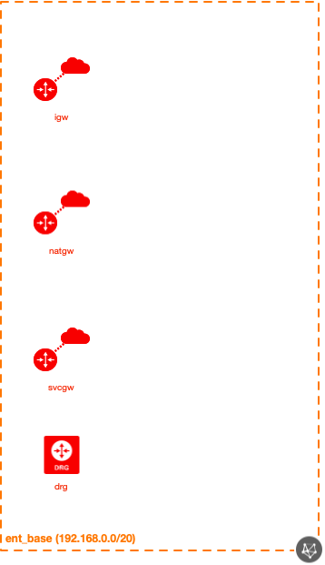

# OCI Enterprise Base Module Example (Simple)

## Introduction

| Complexity |
|---|
| Simple |

This example shows how to utilize the Enterprise Base module in a very simplistic way, generating a ready-to-use OCI environment.  Here are all of the resources created in this example:

* 1x Network module
  * 1x VCN
  * 1x IGW
  * 1x SVCGW
  * 1x NATGW
  * 1x DRG
  * 3x Route Tables
  * 1x Security List (+ clearing the default Security List)
  * 2x DHCP Options

This particular scenario shows how to add Security List rules to the VCN-wide Security List, where two rules (one ingress, one egress) has been added in addition to the default rules.

If the default rules were not to be used, the `use_default_vcn_wide_rules` attribute could be set to false, which would only use the two rules we've supplied.  This example doesn't show this, so you'd need to change this parameter yourself and try it out to see this!

## Topology Diagram
This example is intended to the following OCI topology:



## Using this example
Prepare one variable file named `terraform.tfvars` with the required information (or feel free to copy the contents from `terraform.tfvars.template`).  The contents of `terraform.tfvars` should look something like the following:

```
tenancy_ocid = "ocid1.tenancy.oc1..xxxxxxxxxxxxxxxxxxxxxxxxxxxxxxxxxxxxxxxxxxxxxxxxxxxxxxxxxxxx"
user_ocid = "ocid1.user.oc1..xxxxxxxxxxxxxxxxxxxxxxxxxxxxxxxxxxxxxxxxxxxxxxxxxxxxxxxxxxxx"
fingerprint= "xx:xx:xx:xx:xx:xx:xx:xx:xx:xx:xx:xx:xx:xx:xx:xx"
private_key_path = "~/.oci/oci_api_key.pem"
region = "us-phoenix-1"
default_compartment_ocid = "ocid1.compartment.oc1..xxxxxxxxxxxxxxxxxxxxxxxxxxxxxxxxxxxxxxxxxxxxxxxxxxxxxxxxxxxx"
default_ssh_auth_keys=[ "<path to your public SSH key(s)>" ]
# see https://docs.cloud.oracle.com/iaas/images/ for a listing of OCI-provided image OCIDs
default_img_id="<image OCID>"
default_img_name="<image name>"
```

Then apply the example using the following commands:

```
$ terraform init
$ terraform plan
$ terraform apply
```
## License

Copyright (c) 2020, Oracle and/or its affiliates.

Licensed under the Universal Permissive License v 1.0 as shown at https://oss.oracle.com/licenses/upl.