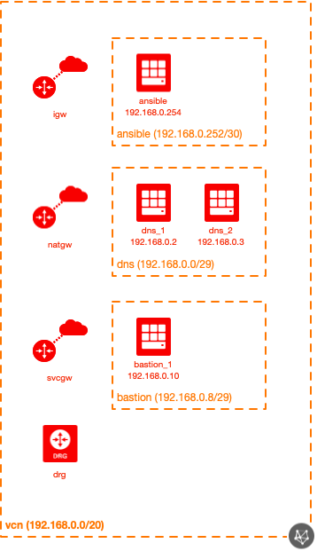

# OCI Enterprise Base Module Example (Simple)

## Introduction

| Complexity |
|---|
| Simple |

This example shows how to utilize the Enterprise Base module in a very simplistic way, generating a ready-to-use OCI environment.  Here are all of the resources created in this example:

* 1x Network module
  * 1x VCN
  * 1x IGW
  * 1x SVCGW
  * 1x NATGW
  * 1x DRG
  * 3x Route Tables
  * 1x Security List (+ clearing the default Security List)
  * 2x DHCP Options
* 1x Hybrid DNS module
  * 1x Subnet
  * 2x Compute instances
  * 1x NSG
  * NSG rules
* 1x Bastion module
  * 1x Subnet
  * 1x Compute instances
  * 1x NSG
  * NSG rules
* 1x Ansible module
  * 1x Subnet
  * 1x Compute instances
  * 1x NSG
  * NSG rules

This example shows how to deploy this in a fast, non-customized manner (using most of the defaults).

The bastion has a public IP and can be accessed via SSH from any system on the Internet (so make sure you provide your authorized SSH key(s)!).

In this scenario, we have a fictitious non-OCI environment that we'll be configuring for DNS forwarding.  Here are the following settings:

DNS namespace mappings:

* anothervcn.oraclevcn.com. > 10.1.2.3
* onprem.local. > 172.16.3.2

Reverse DNS mappings:

* 10.0.0.0/16 > 10.1.2.3
* 172.16.0.0/12 > 172.16.3.2

## Topology Diagram
This example is intended to the following OCI topology:



## Using this example
Prepare one variable file named `terraform.tfvars` with the required information (or feel free to copy the contents from `terraform.tfvars.template`).  The contents of `terraform.tfvars` should look something like the following:

```
tenancy_ocid = "ocid1.tenancy.oc1..xxxxxxxxxxxxxxxxxxxxxxxxxxxxxxxxxxxxxxxxxxxxxxxxxxxxxxxxxxxx"
user_ocid = "ocid1.user.oc1..xxxxxxxxxxxxxxxxxxxxxxxxxxxxxxxxxxxxxxxxxxxxxxxxxxxxxxxxxxxx"
fingerprint= "xx:xx:xx:xx:xx:xx:xx:xx:xx:xx:xx:xx:xx:xx:xx:xx"
private_key_path = "~/.oci/oci_api_key.pem"
region = "us-phoenix-1"
default_compartment_ocid = "ocid1.compartment.oc1..xxxxxxxxxxxxxxxxxxxxxxxxxxxxxxxxxxxxxxxxxxxxxxxxxxxxxxxxxxxx"
default_ssh_auth_keys=[ "<path to your public SSH key(s)>" ]
# see https://docs.cloud.oracle.com/iaas/images/ for a listing of OCI-provided image OCIDs
default_img_id="<image OCID>"
default_img_name="<image name>"
```

Then apply the example using the following commands:

```
$ terraform init
$ terraform plan
$ terraform apply
```
## License

Copyright (c) 2020, Oracle and/or its affiliates.

Licensed under the Universal Permissive License v 1.0 as shown at https://oss.oracle.com/licenses/upl.