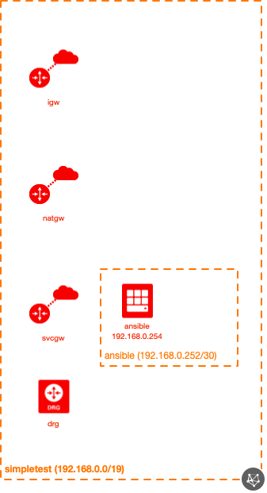

# OCI Ansible Architectural Module Example (Simple)

## Introduction

| Complexity |
|---|
| Simple |

This example shows how to utilize the sdf-oci-arch-ansible-control-machine module in a very simplistic way, generating a VCN along with some accompanying resources.  Here are all of the resources created in this example:

* 1x VCN
* 1x IGW
* 1x SVCGW
* 1x NATGW
* 1x DRG
* 3x Route Tables
* 2x DHCP Options
* 1x NSG
* 1x Subnet
* 1x Compute instance

This example shows how to integrate the Ansible module with the sdf-oci-core-network module for the underlying VCN and infrastructure creation.

## Topology Diagram
This example is intended to the following OCI topology:



## Using this example
Prepare one variable file named `terraform.tfvars` with the required information (or feel free to copy the contents from `terraform.tfvars.template`).  The contents of `terraform.tfvars` should look something like the following:

```
tenancy_id = "ocid1.tenancy.oc1..xxxxxxxxxxxxxxxxxxxxxxxxxxxxxxxxxxxxxxxxxxxxxxxxxxxxxxxxxxxx"
user_id = "ocid1.user.oc1..xxxxxxxxxxxxxxxxxxxxxxxxxxxxxxxxxxxxxxxxxxxxxxxxxxxxxxxxxxxx"
fingerprint= "xx:xx:xx:xx:xx:xx:xx:xx:xx:xx:xx:xx:xx:xx:xx:xx"
private_key_path = "<path to your private key>"
region = "us-phoenix-1"
default_compartment_id = "ocid1.compartment.oc1..xxxxxxxxxxxxxxxxxxxxxxxxxxxxxxxxxxxxxxxxxxxxxxxxxxxxxxxxxxxx"
default_ssh_auth_keys=[ "<path to your public SSH key(s)>" ]
# see https://docs.cloud.oracle.com/iaas/images/ for a listing of OCI-provided image OCIDs
default_img_id="<image OCID>"
# if you'd rather use a compute image name, provide that here instead of the OCID above
default_img_name="<image name>"
```

Then apply the example using the following commands:

```
$ terraform init
$ terraform plan
$ terraform apply
```
